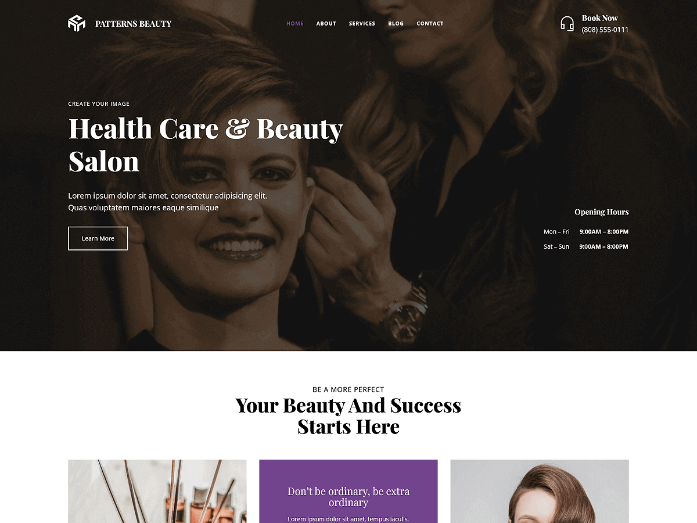

# Patterns Beauty

Patterns Beauty is an elegant and sophisticated WordPress theme designed for beauty salons, spas, wellness centers, and makeup artists. Built with WordPress Full Site Editing (FSE), this theme allows seamless customization of headers, footers, templates, and global styles directly within the WordPress Site Editor. The theme includes pre-designed patterns and layouts crafted for showcasing beauty services, product offerings, testimonials, portfolios, appointment booking, and contact information. Includes layouts for showcasing feature sections, services, about, appointments, prices, photo gallery, portfolios, team, testimonials, contact page, and more. Its responsive design ensures that your website looks stylish and professional across all devices, providing a stunning platform to connect with your clients.

Primary color: `#72448D`.



## Features

- 3 hero and landing patterns
- 3 card layouts (card-1 through card-3)
- 1 service section pattern
- 5 archive/post-listing patterns
- Contact page pattern (page-contact)
- 1 menu navigation pattern
- 13 section layout patterns (featured sections and section titles)
- Full Site Editing (FSE) support
- Responsive design
- 63 block patterns + 15 templates + 11 template parts
- Beauty and salon oriented layouts (services, gallery, contact)

## Requirements

- WordPress 6.6 or higher
- PHP 7.0 or higher
- Tested up to WordPress 6.7

## Development

This theme uses `@wordpress/scripts`:

```sh
npm install
npm run start    # dev mode with watch
npm run build    # production build
```

## License

GNU General Public License v2 or later.

This theme is based on [WP Block Theme Boilerplate](https://github.com/codersantosh/wp-block-theme-boilerplate), (C) 2025 Santosh Kunwar, [GPLv2 or later](https://www.gnu.org/licenses/gpl-2.0.html).
